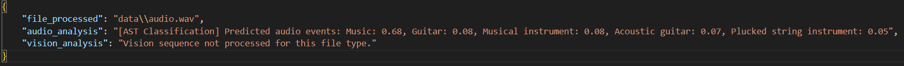
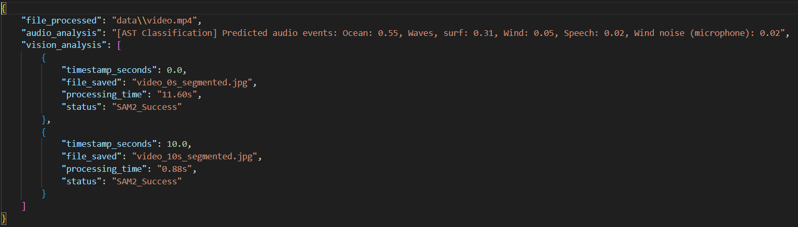

# OmniSeg-Audio-Pipeline: Multimodal Intelligence 🤖🎙️👁️

[](https://www.python.org/downloads/)
[](https://github.com/facebookresearch/segment-anything-2)
[](https://huggingface.co/docs/transformers/model_doc/audio-spectrogram-transformer)

A high-performance, modular processing engine that synchronizes **Computer Vision** and **Acoustic Intelligence**. This pipeline leverages Meta's State-of-the-Art **Segment Anything Model 2 (SAM 2)** for visual isolation and MIT's **Audio Spectrogram Transformer (AST)** for environmental sound classification.

---

## Key Architectural Advantages

* **Hybrid Multimodality**: Simultaneously processes `.mp4` video, `.jpg` images, and `.wav` audio through unified dispatching logic.
* **$O(1)$ Resource Management**: Optimized for edge hardware (e.g., NVIDIA MX150). Implements a strict "Process & Purge" cycle, clearing VRAM between tasks to prevent memory leakage.
* **Temporal Video Slicing**: Efficiently extracts keyframes at defined intervals (e.g., 10s) to track visual changes without the overhead of full-frame processing.
* **Production-Ready Output**: Generates standardized JSON reports and segmented visual overlays for seamless database integration.

---

## Technical Showcase

### 1. Static Image Segmentation ([SAM 2 by Meta](https://github.com/facebookresearch/segment-anything-2))
The engine performs high-precision object isolation by mapping central mass coordinates. It generates high-fidelity segmentation masks for complex biological subjects, maintaining edge integrity even in high-contrast environments.

| Source Image (Tiger) | Segmented Output (Mask) |
|:---:|:---:|
|  |  |

*Figure 1: Comparison between the raw input and the generated SAM 2 segmentation overlay.*

---

### 2. Acoustic Event Detection ([AST by MIT](https://github.com/YuanGongND/ast))
The system extracts native audio streams and classifies environmental contexts using the **Audio Spectrogram Transformer**. It provides a probabilistic breakdown of acoustic events (e.g., instruments, speech, or nature) with millisecond-precision timestamps.

**Automated JSON Reporting:**


---

### 3. Unified Video & Metadata Intelligence ([SAM 2](https://github.com/facebookresearch/segment-anything-2) & [AST](https://github.com/YuanGongND/ast))
For `.mp4` payloads, the pipeline merges temporal visual tracking with synchronized acoustic analysis. Media orchestration is handled via **OpenCV** and **FFmpeg** to perform high-speed frame extraction and audio demuxing, feeding raw streams into the specialized AI engines. This creates a multi-layered metadata report containing both pixel-perfect object coordinates and chronological acoustic signatures.

| Video Frame: Beach | Segmented Environment |
|:---:|:---:|
|  |  |

**Comprehensive Video Pipeline Metadata:**


---

## 🛠️ System Requirements

### 1. External Dependencies
- **FFmpeg**: Required for native audio stream extraction and video demuxing.
  - *Windows*: `winget install "FFmpeg (Shared)"`
  - *Linux*: `sudo apt install ffmpeg`

### 2. Environment Setup
```bash
# Clone the repository
git clone https://github.com/LTolo/OmniSeg-Audio-Pipeline.git
cd OmniSeg-Audio-Pipeline

# Create a clean virtual environment
python -m venv .venv
# Activate on Windows:
.venv\Scripts\activate

# Install dependencies
pip install -r requirements.txt
