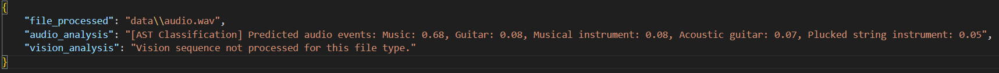
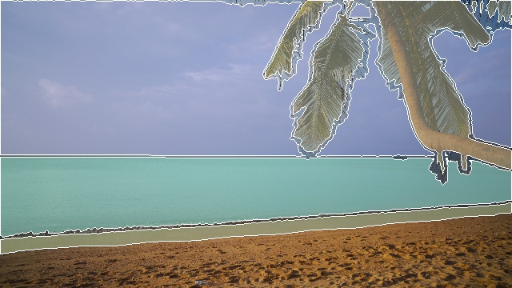
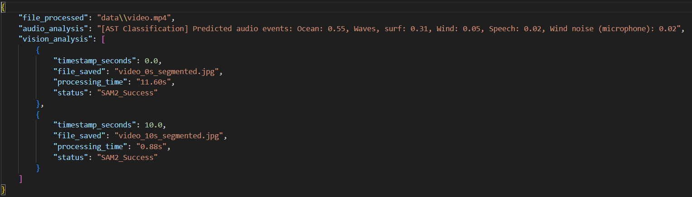

<h1 align="center">OmniSeg-Audio-Pipeline</h1>

<p align="center">
  <b>A multimodal intelligence engine that synchronizes computer vision and acoustic analysis.</b><br>
  Meta <b>SAM 2</b> for visual segmentation · MIT <b>AST</b> for environmental sound classification.
</p>

<p align="center">
  <a href="https://github.com/LTolo/OmniSeg-Audio-Pipeline/actions/workflows/ci.yml"></a>
  
  <a href="https://github.com/facebookresearch/segment-anything-2"></a>
  <a href="https://huggingface.co/docs/transformers/model_doc/audio-spectrogram-transformer"></a>
  <a href="LICENSE"></a>
</p>

---

A high-performance, modular processing engine that synchronizes **computer vision** and
**acoustic intelligence**. The pipeline leverages Meta's **Segment Anything Model 2 (SAM 2)**
for visual isolation and MIT's **Audio Spectrogram Transformer (AST)** for environmental
sound classification, unifying `.mp4`, `.jpg`, and `.wav` inputs under one dispatcher.

## Key architectural advantages

- **Hybrid multimodality:** Processes video, images, and audio through unified dispatching logic.
- **Disciplined VRAM management:** A strict *"process &amp; purge"* cycle clears CUDA memory
  between tasks — tuned to run on modest edge GPUs (e.g. NVIDIA MX150).
- **Temporal video slicing:** Extracts keyframes at fixed intervals (e.g. every 10 s) to track
  visual change without the cost of full-frame processing.
- **Production-ready output:** Emits standardized JSON reports plus segmented visual overlays
  for downstream database integration.

## Showcase

### 1. Static image segmentation (SAM 2)

High-precision object isolation with high-fidelity masks that preserve edge integrity even in
high-contrast scenes.

<table>
  <tr>
    <th align="center">Source image</th>
    <th align="center">Segmented output</th>
  </tr>
  <tr>
    <td></td>
    <td></td>
  </tr>
</table>

### 2. Acoustic event detection (AST)

The engine extracts the native audio stream and classifies environmental context with the
Audio Spectrogram Transformer, producing a probabilistic breakdown of acoustic events.



### 3. Unified video + metadata intelligence (SAM 2 &amp; AST)

For `.mp4` payloads the pipeline merges temporal visual tracking with synchronized acoustic
analysis. Media orchestration uses **OpenCV** and **FFmpeg** for frame extraction and audio
demuxing, feeding both engines to build a layered metadata report.

<table>
  <tr>
    <th align="center">Video frame</th>
    <th align="center">Segmented environment</th>
  </tr>
  <tr>
    <td></td>
    <td></td>
  </tr>
</table>




## Requirements

**External:** [FFmpeg](https://ffmpeg.org/) for audio extraction / demuxing.

```bash
# Windows
winget install "FFmpeg (Shared)"
# Linux
sudo apt install ffmpeg
```

## Getting started

```bash
git clone https://github.com/LTolo/OmniSeg-Audio-Pipeline.git
cd OmniSeg-Audio-Pipeline

# Create and activate a virtual environment
python -m venv .venv
# Windows:  .venv\Scripts\activate
# Linux/macOS:  source .venv/bin/activate

# Install dependencies
pip install -r requirements.txt

# Drop .mp4 / .jpg / .wav files into data/, then run:
python run_smart_dispatcher.py
```

Outputs (segmented media + JSON reports) are written to `data/processed/`.

## Project structure

```
OmniSeg-Audio-Pipeline/
├── run_smart_dispatcher.py   # Watches data/ and dispatches by file type
├── run_omni_pipeline.py      # Orchestrates audio → vision → report per file
├── src/
│   ├── main.py               # VisionEngine (SAM 2): image & frame segmentation
│   └── audio_processor.py    # AudioEngine (AST): acoustic event classification
├── sam2_hiera_t.yaml         # SAM 2 (Hiera-Tiny) model config
├── requirements.txt          # torch, torchaudio, opencv, transformers, sam2, ...
├── assets/                   # Showcase images used in this README
└── .github/workflows/        # CI: syntax + critical-lint gate
```

## Tech stack

**Python 3.11+** · **PyTorch** · **SAM 2** (Meta) · **AST** (MIT, via 🤗 Transformers) ·
**OpenCV** · **FFmpeg** · **torchaudio**

> **Note on CI:** the full pipeline needs GPU-class hardware and multi-gigabyte model
> weights, so CI does not run inference. Instead it acts as a fast **code-quality gate**,
> validating that every module compiles and is free of critical lint errors across Python
> 3.11 and 3.12.

## License

Released under the [MIT License](LICENSE). SAM 2 and AST are the property of their
respective authors and are used under their own licenses.
